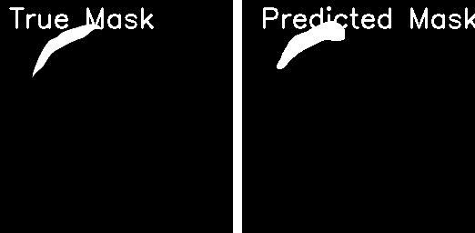

Here's the updated `README.md` with the results section including the image placeholder and metrics:

---

# Pneumothorax Detection using U-Net++ Architecture

This project focuses on detecting **Pneumothorax** in lung images using deep learning, specifically using a **U-Net++** architecture for image segmentation.

## Table of Contents
- [Project Overview](#project-overview)
- [Model Architecture](#model-architecture)
- [Prerequisites](#prerequisites)
- [Dataset](#dataset)
- [Training the Model](#training-the-model)
- [Evaluation and Metrics](#evaluation-and-metrics)
- [Prediction](#prediction)
- [Usage](#usage)
- [Results](#results)
- [License](#license)

## Project Overview
This project aims to build a model for segmenting Pneumothorax areas from lung X-ray images. Pneumothorax is a critical condition in which air leaks into the space between the lung and chest wall, causing the lung to collapse. Early detection can save lives. We use **U-Net++**, a state-of-the-art architecture for medical image segmentation.

## Model Architecture
The U-Net++ model used here is designed with:
- Multiple convolutional and transposed convolutional layers
- Dense skip connections between encoder-decoder blocks
- Dice loss function with Binary Cross-Entropy for segmentation accuracy

The model also computes Intersection over Union (IoU) and Dice Coefficient as metrics.

### Model Overview:
- Input size: 256x256 pixels
- Output: Pneumothorax segmentation mask
- Optimizer: Adam with a learning rate of 1e-4
- Loss function: Binary Cross-Entropy (BCE) + Dice Loss

## Prerequisites
- Python 3.7+
- TensorFlow / Keras
- NumPy
- Pandas
- Scikit-image
- Scikit-learn
- OpenCV
- Matplotlib
- tqdm

You can install the dependencies using:
```bash
pip install -r requirements.txt
```

## Dataset
The dataset consists of lung X-ray images with corresponding Pneumothorax masks. You can use the dataset provided in the **SIIM-ACR Pneumothorax Segmentation** challenge available on [Kaggle](https://www.kaggle.com/c/siim-acr-pneumothorax-segmentation/).

- **Images**: Resized to 256x256 pixels for faster processing.
- **Masks**: Binary masks corresponding to the Pneumothorax regions in the images.

Place your images and masks in the following directory structure:
```
project/
│
├── png_images/       # Folder containing X-ray images
├── png_masks/        # Folder containing binary masks
├── train_images.csv  # CSV file with train image filenames and labels
├── test_images.csv   # CSV file with test image filenames
```

## Training the Model
To train the model, run the following script:

```bash
python main.py
```

This will:
- Load and preprocess the dataset.
- Train the U-Net++ model using the provided training and validation data.
- Save the best model as `unetplusplus_best_model.hdf5`.

### Training Parameters
- **Epochs**: 20
- **Batch Size**: 16
- **Optimizer**: Adam
- **Early stopping**: Stops the training if validation loss doesn't improve after 10 epochs.

## Evaluation and Metrics
The model is evaluated based on the following metrics:
- **Dice Coefficient**: Measures the overlap between the predicted segmentation and ground truth.
- **Intersection over Union (IoU)**: Measures the intersection area divided by the union area of the predicted mask and ground truth.
- **Accuracy, Precision, Recall, F1 Score**: Standard classification metrics.

After training, evaluation results, confusion matrix, and metrics are plotted and saved.

## Prediction
To run predictions on test data, use the `pred.py` script:

```bash
python pred.py --image_path <path_to_test_image>
```

This will:
- Load the trained model.
- Preprocess the input image.
- Predict the Pneumothorax segmentation mask.
- Display the predicted mask alongside the original image.

## Usage
### Train the Model:
```bash
python main.py
```

### Make Predictions:
```bash
python pred.py --image_path <path_to_image>
```

## Results

### Performance Metrics:
- **Accuracy**: 0.933769327
- **Precision**: 0.937879157
- **Recall**: 0.933769328
- **F1 Score**: 0.933769328

### Example of Predicted Mask:


The following image shows an example of the predicted Pneumothorax mask overlayed on the lung X-ray image.

### Training and Validation Loss:
The model's loss and accuracy curves during training are saved as plots.

## License
This project is open-source and available under the MIT License.
